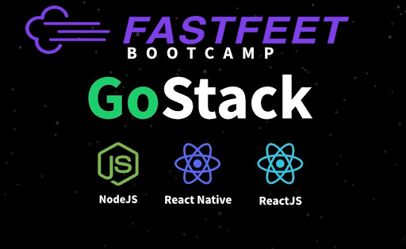

<h1 align="center">
  
  </h1>
  <p align="center">Aplicação de uma transportadora fictícia, desafio final do bootcamp GoStack 10.0, foi dividido em 4 partes, e será uma aplicação completa(Back-end, Front-end e Mobile). </p>
  
  <p align="center"> Arquivos do primeiro e segundo desafio disponiveis, atualização em breve, conforme for terminando os proximos.</p>
  
 <p align="center">
 <a href="#tecnologias-rocket">Tecnologias</a>&nbsp;&nbsp;&nbsp;|&nbsp;&nbsp;&nbsp;
 <a href="#instalação-execução-e-desenvolvimento--">Instalação, execução e desenvolvimento</a>&nbsp;&nbsp;&nbsp;|&nbsp;&nbsp;&nbsp;
 <a href="#como-contribuir">Como contribuir</a>
</p>

<p id="insomniaButton" align="center">
  <a href="https://insomnia.rest/run/?label=FastFeet&uri=https%3A%2F%2Fraw.githubusercontent.com%2FHenriqueVAzquez%2FFastFeet%2Fmaster%2Fbackend%2fInsomnia_FastFeet_HenriqueVazquez.json" target="_blank"></a>
</p>

<strong>Links dos desafios:</strong>

- [Etapa 1](https://github.com/HenriqueVazquez/FastFeet/blob/master/DESAFIO1.md)
- [Etapa 2](https://github.com/HenriqueVazquez/FastFeet/blob/master/DESAFIO2.md)


  ## Tecnologias :rocket:

Esse projeto foi desenvolvido com as seguintes tecnologias:

- [Node.js](https://nodejs.org/en/)
- [PostgreSQL](https://www.postgresql.org/)
- [Express](https://github.com/expressjs/express)
- [Bcryptjs](https://www.npmjs.com/package/bcryptjs)
- [Jsonwebtoken](https://jwt.io/introduction/)
- [Sequelize](https://sequelize.org/)
- [Yup](https://github.com/jquense/yup)
- [cors](https://github.com/expressjs/cors#readme)
- [sentry](https://github.com/getsentry/sentry-javascript/tree/master/packages/node)
- [Bee-queue] (https://github.com/bee-queue/bee-queue)
- [date-fns] (https://github.com/date-fns/date-fns#readme)
- [dotenv] (https://github.com/motdotla/dotenv#readme)
- [express-async-errors] (https://github.com/davidbanham/express-async-errors#readme)
- [express-handlebars] (https://github.com/express-handlebars/express-handlebars)
- [mongoose] (https://mongoosejs.com/)
- [multer] (https://github.com/expressjs/multer#readme)
- [nodemailer-express-handlebars] (https://github.com/yads/nodemailer-express-handlebars)
- [nodemailer] (https://nodemailer.com/)
- [Faker] (https://github.com/Marak/Faker.js#readme)
- [eslint] (https://eslint.org/)
- [prettier] (https://eslint.org/)
- [nodemon] (http://nodemon.io/)
- [sucrase] (https://github.com/alangpierce/sucrase#readme)


## Instalação, execução e desenvolvimento  🤔

Importe o arquivo `Insomnia_FastFeet_HenriqueVazquez.json` no Insomnia ou clique no botão [Run in Insomnia](#insomniaButton)

### Pré-requisitos

**Faça um clone desse repositório**

###  Backend 🍳

- A partir da raiz do projeto, entre na pasta executando `cd backend`;
- Ajuste as suas variáveis de ambiente no arquivo `.env`;
- Execute `yarn` para instalar as dependências;
- Execute `docker-compose up -d` para montar o ambiente;
- Execute `yarn sequelize db:migrate` para executar as migrations;
- Para executar somente a migration de `admin-user` execute o comando `yarn sequelize db:seed --seed 20200504181041-admin-user.js`
- Execute `yarn start` para iniciar o servidor;

## Como contribuir🤔

- **Faça um fork deste repositório**

```bash
# Fork via GitHub official command line
# Caso não tenha o GitHub CLI, realize o fork pelo site.

$ gh repo fork HenriqueVazquez/FastFeet
```

```bash
# Clone o seu fork
$ git clone url-do-seu-fork && cd FastFeet

# Crie uma branch com sua feature
$ git checkout -b minha-feature

# Faça o commit das suas alterações
$ git commit -m 'feat: Minha nova feature'

# Faça o push para a sua branch
$ git push origin minha-feature
```

Depois que o merge da sua pull request for feito, você pode deletar a sua branch.

---

Feito por [Henrique Vazquez](https://www.linkedin.com/in/henrique-vazquez-11905ab6/) :wink:
